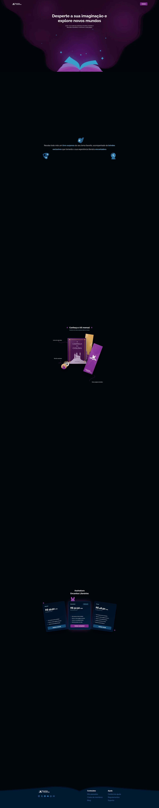

# Encantos Literários

Landing page de apresentação do clube de assinatura de livros **Encantos Literários**, com animações de rolagem, apresentação do kit mensal e comparação de planos.

## Captura de tela



## Tecnologias

- HTML5
- CSS3
- JavaScript puro
- Google Fonts (Raleway) e Bootstrap Icons via CDN

## Como executar

O projeto é estático e não precisa de instalação de dependências nem de etapa de build.

1. Abra `index.html` diretamente no navegador; ou
2. Abra a pasta no VS Code e execute com uma extensão de servidor local, como o Live Server.

O acesso à internet é necessário para carregar a fonte e os ícones externos.

## Estrutura

```text
.
├── assets/       # Imagens, ilustrações e ícones
├── css/          # Estilos da página, organizados por seção
├── index.html    # Estrutura da landing page
├── script.js     # Animações e interações acionadas pela rolagem
└── README.md
```

## Observações antes de publicar

- Os botões de assinatura e vários links sociais e de navegação ainda usam `href="#"`. Substitua-os pelos destinos reais antes de disponibilizar o site.
- A fonte e os ícones são carregados de serviços externos; sem internet, a página usa fontes alternativas e os ícones podem não aparecer.
